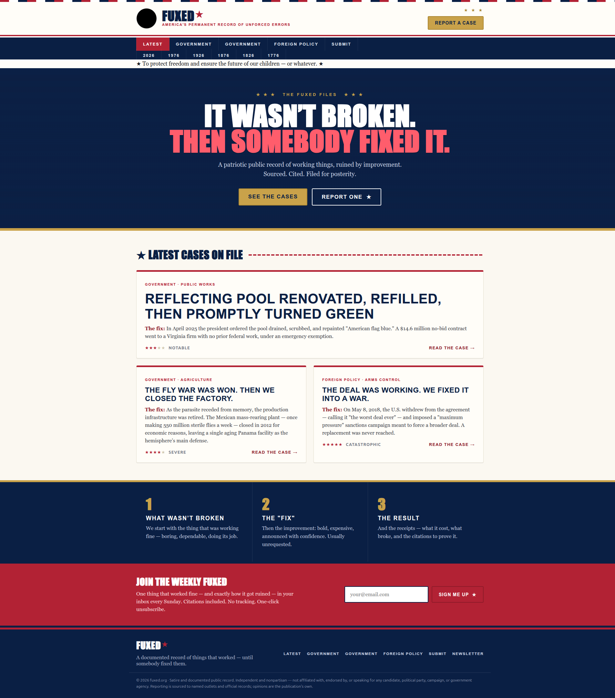
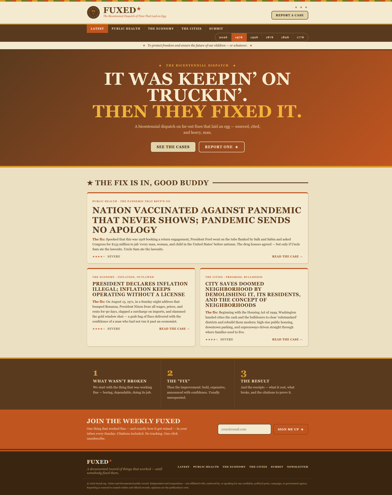
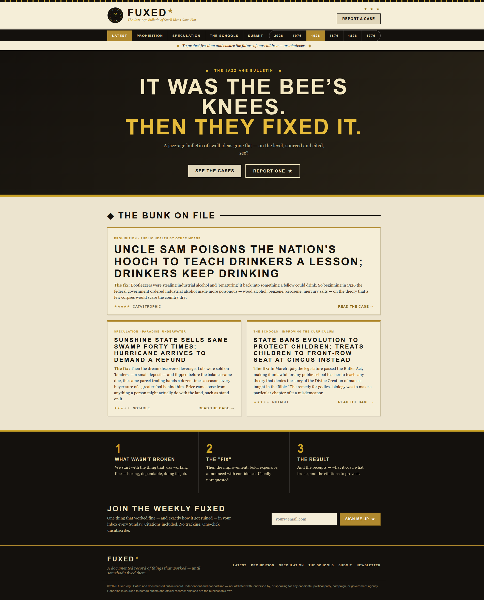
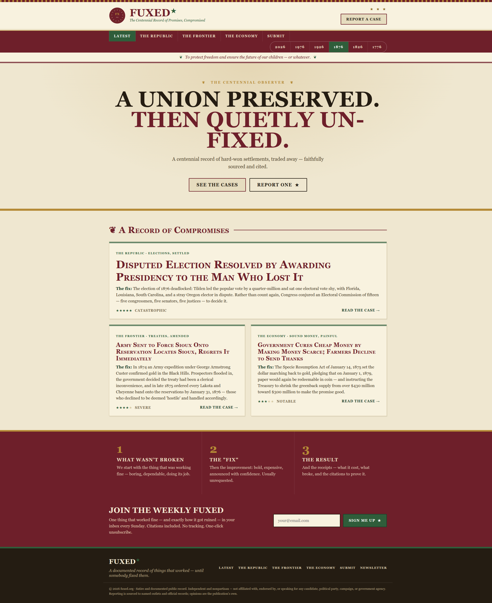
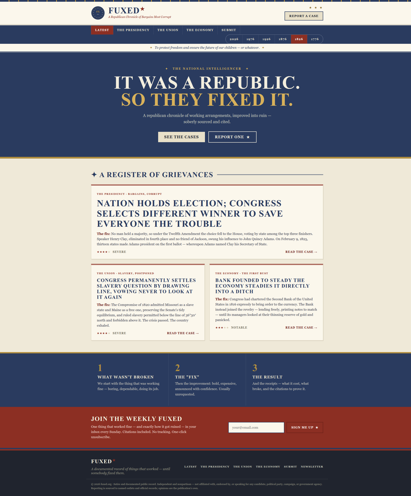
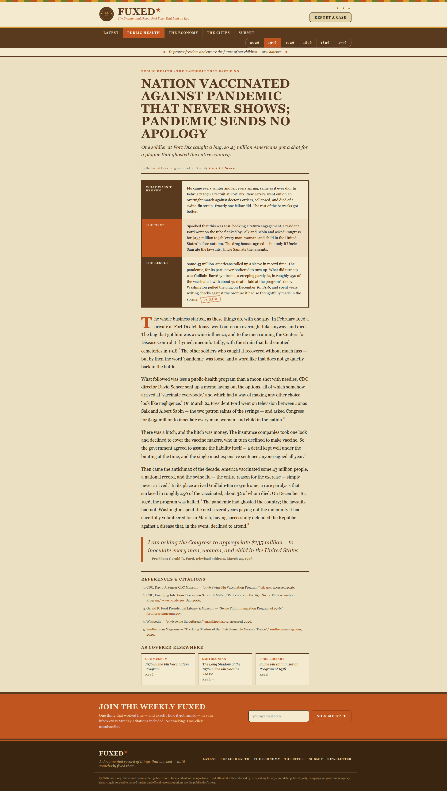
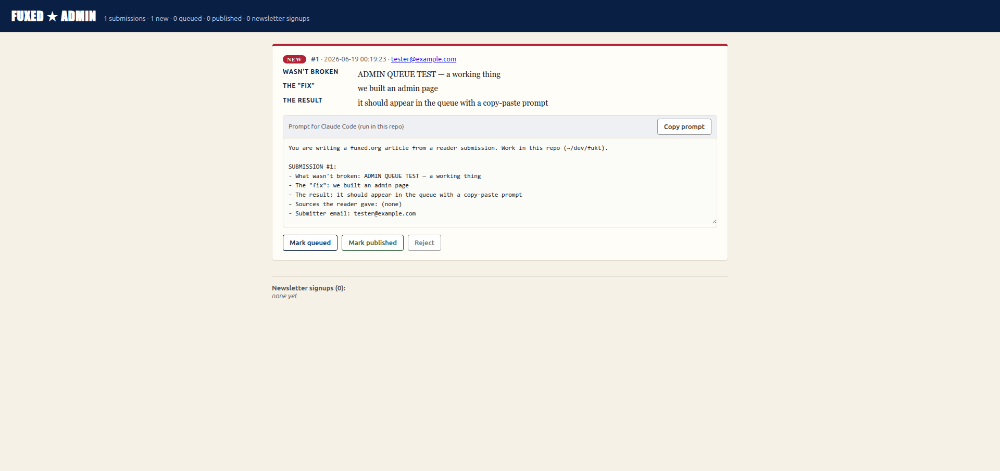

# FUXED ★

**[fuxed.org](https://fuxed.org)** — a satirical, fully-cited record of things that *weren't broken* until somebody **"fixed"** them and made them worse.

> *It wasn't broken. Then somebody fixed it.*

---

## Where the name came from (a typo)

This whole thing started as a typo. In a text thread with my brother — riffing on government officials "fixing" things that were working fine and making them worse — he meant to type **"fixed"** and it came out **"fuxed."** It was funnier than the joke we were already making. On a whim I checked the domain: **fuxed.org** was available for about nine dollars. Reader, I bought it.

So this is a joke domain with a real premise: a deadpan, credible-looking publication that documents *fuxed* situations — something that worked, a confident "fix," and the receipts on how it went.

Each entry follows the same shape:

1. **What wasn't broken** — the thing that was working fine.
2. **The "fix"** — the bold, usually unrequested improvement, and how it was justified.
3. **The result** — what it actually cost, with real citations.

## Six eras, every 50 years

The site is six editions, each 50 years apart — **2026 · 1976 · 1926 · 1876 · 1826 · 1776** — and each is built to read like *an artifact of its own time*: period typography and color, period voice and slang, contemporaneous references, and punchy, deadpan, *Onion*-style headlines. The reporting underneath stays sober and sourced; the joke lives in the contrast.

| Edition | Look | A sample case |
|---|---|---|
| **2026** | patriotic flag (Impact / navy-red) | The reflecting pool repainted "American flag blue," green with algae in a day |
| **1976** | Bicentennial 70s (Bookman / brown-gold-orange) | 43 million vaccinated against a swine-flu pandemic that never showed up |
| **1926** | Jazz-Age Deco (Futura / black-gold) | The government poisons the nation's bootleg liquor to scare people sober |
| **1876** | Victorian Centennial (Goudy / oxblood-gold) | A disputed election handed to the man who lost it — at the cost of Reconstruction |
| **1826** | Federal Didone (Bodoni / blue-buff) | Congress picks a different election winner; Jackson cries "corrupt bargain" |
| **1776** | Colonial broadside (Baskerville / parchment) | Parliament makes tea *cheaper* and receives a riot in return |

Every edition shares a nav **edition picker**, a motto bar (*"To protect freedom and ensure the future of our children — or whatever."*), and a `/submit` tip line.

## Screenshots

| 2026 — flag | 1976 — Bicentennial |
|---|---|
|  |  |

| 1926 — Jazz-Age Deco | 1876 — Victorian |
|---|---|
|  |  |

| 1826 — Federal | 1776 — Colonial |
|---|---|
|  |  |

**An article page** (the signature dossier block + real references):



---

## How AI built this

The entire site — research, writing, design, code, and deployment — was produced with **[Claude Code](https://www.anthropic.com/claude-code)** (Anthropic's agentic coding tool), with a human directing and approving each step. Here's honestly how each part was done.

### 1. Finding the stories (research)
For each era, the AI ran **web searches** to surface real, documented cases of a *fix that backfired* — not invented ones. Early editions were explored with **parallel research sub-agents**; once it became clear that good comedy needs the stronger model, the research and writing were done **inline** by the main model. Either way, every candidate had to be a genuine, citable historical event (the Tea Act of 1773, the Panic of 1819, Dred Scott, the Compromise of 1877, the 1926 "Chemist's War" of poisoned alcohol, the 1976 swine-flu program, and so on).

### 2. Verifying and curating
Candidate facts — dates, figures, quotes, outcomes — were **checked against reputable sources**: the National Archives, Library of Congress, CDC, Federal Reserve History, the Avalon Project, court opinions (e.g. *United States v. Sioux Nation*), Britannica, and named newspapers and museums. The AI then **curated three cases per edition**, kept the **citations as real, resolving URLs**, and discarded anything it couldn't source. Pull-quotes are real and attributed; where a line is the publication's own, it's credited to "The Fuxed Desk," not faked onto an outlet.

### 3. Writing in the voice of the time
Each piece was written to feel like an **artifact of its decade**: a deadpan, period-appropriate voice with the era's idiom and slang (formal 18th-century for 1776, Jacksonian oratory for 1826, Roaring-Twenties patter for 1926, CB-radio Bicentennial for 1976), topped with a sharp, *Onion*-style headline. The **dossier facts and the citations stay plain and sober** — only the headlines and prose lean into the bit.

### 4. Building the HTML
The site is a **dependency-free static generator** the AI wrote from scratch:

- **`build.js`** renders each edition's articles (stored as JSON in `editions/`) into static HTML — a homepage, an article page per case (with the dossier, footnoted body, and a real "References" list), and a submit page. It normalizes footnotes, derives the nav, and writes everything under `site/`.
- **`theme-css.js`** is a **one base stylesheet + per-era "skin"** system driven by CSS variables. Each era sets its own palette, typefaces, rule styles, and hero treatment — which is how six visually distinct periods come out of one shared layout.

A reusable Claude Code skill, **`/fuxed <year>`**, was also written to generate new editions on demand (research → curate → write → build → deploy).

### 5. Hosting and the tip line
- The static site is deployed to **Cloudflare Pages**.
- **Cloudflare Pages Functions** power the forms: `/api/submit` and `/api/subscribe` **store** each entry in a **Cloudflare D1** database and **email** it via **[Resend](https://resend.com)**, with a hidden-field honeypot for spam. All config (mail + admin) lives in Cloudflare **secrets**; none of it is in the repo.

---

## Admin & moderation queue

Nothing is ever auto-published. Submissions land in D1 and surface in a password-protected queue at **`/admin`** (HTTP Basic Auth). For each one, the admin page generates a ready-to-paste **prompt for Claude Code**:



The workflow is deliberately human-in-the-loop:

1. A reader submits a tip at `/submit` → it's stored and appears in `/admin` as **new**.
2. You click **Copy prompt** and paste it into **Claude Code** opened in this repo. Claude researches the tip, verifies it, gathers real citations, and writes the article in the right edition's era voice — then shows you the draft.
3. **On your approval**, Claude rebuilds that edition and deploys it. You mark the submission **published** (or **queued** / **rejected**) in `/admin`.

So every submission reaches you, but only the ones you approve ever go live.

---

## Repo layout

```
build.js              # static-site generator (no dependencies)
theme-css.js          # shared base CSS + per-era skins (CSS variables)
editions/             # one JSON file per edition (the articles + real citations)
  1776.json  1826.json  1876.json  1926.json  1976.json
  (2026 lives in build.js as the built-in edition)
functions/            # Cloudflare Pages Functions
  api/submit.js       # POST /api/submit    → store + email a case submission
  api/subscribe.js    # POST /api/subscribe → store + email a newsletter signup
  admin.js            # GET/POST /admin     → password-protected submissions queue
schema.sql            # D1 tables (submissions + subscribers)
wrangler.toml.example # copy to wrangler.toml; binds the D1 database
docs/screenshots/     # the images in this README
site/                 # generated output (gitignored; run `npm run build`)
```

## Build & run

No dependencies beyond Node and (for deploy) Wrangler.

```bash
npm run build      # generate the full site into ./site
# serve ./site with any static server, e.g.:
npx serve site
```

Deploy to Cloudflare Pages:

```bash
npm run deploy     # builds, then `wrangler pages deploy site`
```

## Configuration (email)

The submit/newsletter forms are generic and read their config from **Cloudflare Pages secrets** — set these on your own project:

| Secret | Purpose |
|---|---|
| `RESEND_API_KEY` | A [Resend](https://resend.com) API key with send permission |
| `FUXED_NOTIFY_TO` | The address that should receive submissions |
| `FUXED_FROM` | The verified sender, e.g. `Fuxed <fuxed@yourdomain.com>` |

```bash
echo "<key>"            | wrangler pages secret put RESEND_API_KEY  --project-name=fuxed
echo "you@example.com"  | wrangler pages secret put FUXED_NOTIFY_TO --project-name=fuxed
echo "Fuxed <fuxed@…>"  | wrangler pages secret put FUXED_FROM      --project-name=fuxed
```

If the secrets aren't set, the forms still show their thank-you page and simply don't send.

**Database + admin** (for the `/admin` queue):

```bash
wrangler d1 create fuxed-submissions          # then put the id in wrangler.toml
wrangler d1 execute fuxed-submissions --remote --file=schema.sql
echo "<strong-password>" | wrangler pages secret put ADMIN_PASSWORD --project-name=fuxed
# optional: ADMIN_USER (defaults to "admin")
```

`/admin` uses HTTP Basic Auth — user `admin` (or `ADMIN_USER`), password `ADMIN_PASSWORD`.

---

## Disclaimers

- **It's satire.** The framing is comedic commentary on real, documented events. It is **not** original reporting — it cites publicly available sources, and you should verify them yourself before relying on any claim.
- **Nonpartisan.** Not affiliated with, endorsed by, or speaking for any candidate, party, campaign, or government agency. The criticism is aimed at *decisions that backfired*, across two and a half centuries and both parties — not at people.
- **AI-assisted.** Everything here was generated with Claude Code under human direction; the citations are real, but treat the prose as the satire it is.

## License

MIT for the code (see [LICENSE](LICENSE)). The article text is satire and commentary.
